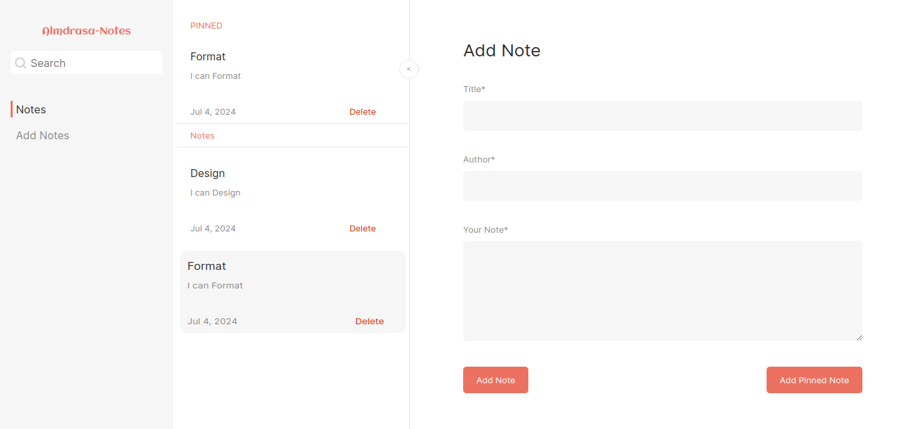

# Note App

The Note App is a simple and intuitive web application designed to help users organize their thoughts, tasks, and ideas efficiently. Built using HTML, SASS, and JavaScript, this app provides a seamless user experience with a clean and responsive interface.

## Features

- **Create Notes**: Easily create new notes with a single click. Add titles and content to keep track of your thoughts and tasks.
- **Delete Notes**: Remove notes that are no longer needed to keep your workspace uncluttered.
- **Search Functionality**: Quickly find specific notes using the search bar. The app dynamically filters notes as you type, making it easy to locate important information.
- **Responsive Design**: The app is fully responsive and works flawlessly on all devices, including desktops, tablets, and smartphones.
- **Local Storage**: Your notes are saved in the browser's local storage, ensuring that they are preserved even after refreshing the page or closing the browser.

## Technologies Used

- **HTML**: Provides the structure and layout of the app.
- **SASS**: Adds styling and ensures the app is visually appealing and user-friendly. SASS allows for more efficient and organized CSS.
- **JavaScript**: Powers the app's functionality, including creating, deleting, and searching notes. It also manages data storage in the browser's local storage.

## How to Use

1. **Clone the repository**:
    ```bash
    git clone https://github.com/Ahmed-Seleem01/note-app.git
    cd note-app
    ```

2. **Compile SASS to CSS**:
    Ensure you have SASS installed. If not, you can install it using npm:
    ```bash
    npm install -g sass
    ```
    Then, compile the SASS file:
    ```bash
    sass styles.scss styles.css
    ```

3. **Open the `index.html` file in your browser**:
    ```bash
    open index.html
    ```

4. **Creating Notes**:
   - Click the "New Note" button to open a text area where you can enter the note title and content. Once you're done, save the note.

5. **Deleting Notes**:
   - Click the delete button on any note to remove it from the list.

6. **Searching Notes**:
   - Use the search bar at the top of the app to filter notes by title. The list of notes updates in real-time as you type.

## Screenshots



## Contributing

1. Fork the repository
2. Create your feature branch (`git checkout -b feature/new-feature`)
3. Commit your changes (`git commit -am 'Add new feature'`)
4. Push to the branch (`git push origin feature/new-feature`)
5. Create a new Pull Request
